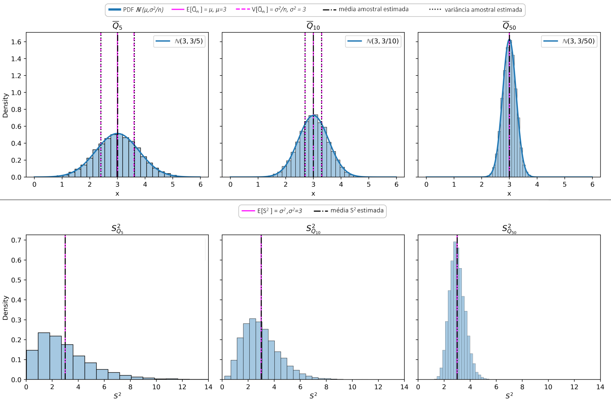
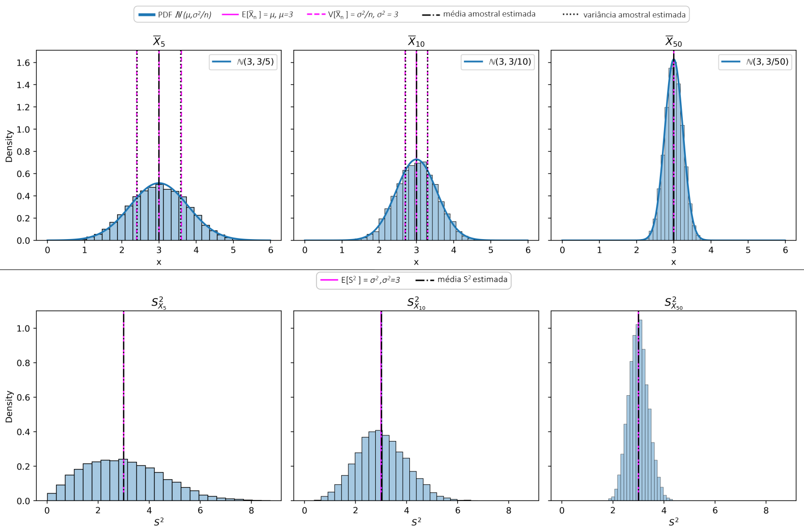
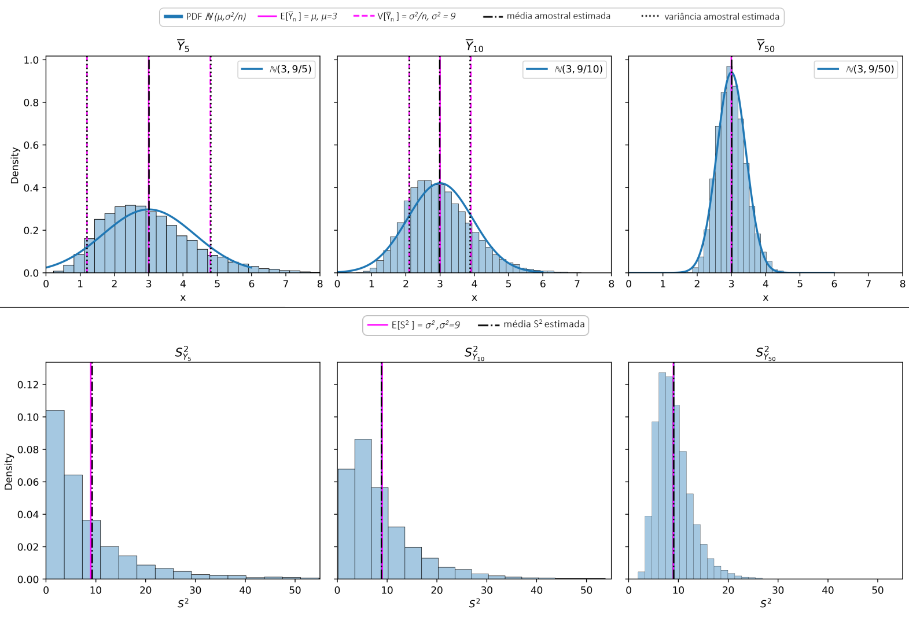
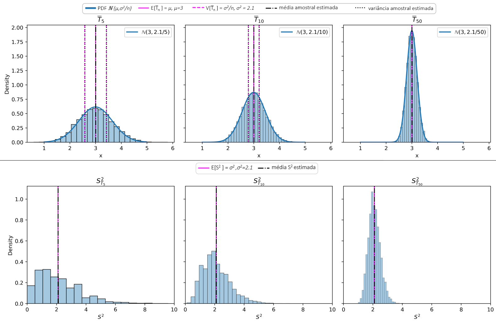
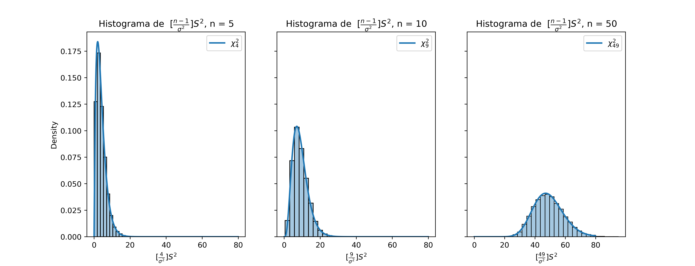

# Estatística GA030 - Trabalho 01
Alex Fabricio Sánchez Yumbo\
Programa de Pós-Graduação em Modelagem Computacional\
Laboratorório Nacional de Computação Científica\
Data de entrega: 21 de novembro 2023\
Período: 2023.4

1. Após abordarmos a Lei dos Grandes Números e o Teorema do Limite Central, chegamos a um ponto crucial do curso: a estimação de parâmetros (desconhecidos) associados à distribuição de probabilidade de uma variável aleatória.\
O presente trabalho tem como objetivo a fixação das ideias introduzidas até aqui. Para isso, utilizaremos dados armazenados em quatro arquivos, que contêm amostras de diferentes variáveis aleatórias, conforme Tabela 1.

<div align="center">
  <strong>Tabela 1.</strong> Descrição das variáveis aleatórias. 
</div>

<div align="center">
  
|Variável                  |  Arquivo  | Distribuição |
|:----------------------------|:-------------|:----------------:|
|$`Q\backsim\mathbb{N}(3,3) `$    |  _data1q.dat_ |      Normal  |
|$` X\backsim\mathbb{U}[0,6] `$    |  _data1x.dat_ |     Uniforme     |
|$` Y\backsim\mathbb{E}(0.333) `$  |  _data1y.dat_ |    Exponencial   |
|$` T\backsim\mathbb{Y}(10,0.30) `$|  _data1t.dat_ |     Binomial     |

</div>

**(a)** Dado que conhecemos a distribuição de probabilidades de cada variável aleatória e os parâmetros que as caracterizam (Tabela 1), calcule a expectância e a variância (teóricas) de cada uma delas, usando as definições que vimos em aula.

Todas as equações para o cálculo da expectância e da variância são definidas na seguinte tabela.

<div align="center">
  <strong>Tabela 2.1:</strong> Equações da expectância e da variância para as diferentes distribuições. 
</div>

<div align="center">

| Normal $`\mathbb{N}(\mu,\sigma^2)`$ | Uniforme $`\mathbb{U}[a,b]`$             | Exponencial $`\mathbb{Y}(\gamma)`$       | Binomial $`\mathbb{B}(N, p)`$ |
|-------------------------------------|------------------------------------------|------------------------------------------|-------------------------------|
| $`E[N] =\mu`$                       | $`E[\mathbb{U}] = \frac{a+b}{2}`$        | $`E[\mathbb{Y}] = \frac{1}{\gamma}`$     | $`E[\mathbb{B}] = Np`$        |
| $`V[N] =\sigma^2`$                  | $`V[\mathbb{U}] = \frac{(b-a)^{2}}{12}`$ | $`V[\mathbb{Y}] = \frac{1}{\gamma^{2}}`$ | $`E[\mathbb{B}] = Np(1-p)`$   |

</div>

Com as equações definidas podemos calcular os valores da expectância e da variância teóricos de cada variável aleatória. Os cálculos são mostrados abaixo.
<div align="center">
  <strong>Tabela 2.2.</strong> Valores da expectância e da variância teóricas para as variáveis aleatórias. 
</div>

<div align="center">

| Variável |Distribuição |      Expectância     |             Variância           |
|----------|:-----------|:---------------------:|:-------------------------------:|
| Q        |Normal      | $`3`$                 | $`3`$                           |
| X        |Uniforme    | $`\frac{0+6}{2} = 3`$ | $`\frac{(6-0)^{2}}{12}= 3`$     |
| Y        |Exponencial | $`\frac{1}{1/3} = 3`$ | $`\frac{1}{{1/3}^{2}}= 9`$      |
| T        |Binomial    | $`10\times0.30 = 3`$  | $`10\times0.30 (1-0.30) = 2.1`$ |

</div>

---

**(b)** Utilize o R (ou outro programa) para ler cada arquivo e calcule estimativas para a média e a variância do conjunto de dados (usando todos os dados disponíveis nos arquivos). Em seguida, compare com os resultados obtidos no exercício anterior. Faça comentários.

Os dados foram lidos e analisados em Python usando as bibliotecas ```numpy``` e ```pandas```. Os cálculos de média e variâncias foram feitos com os métodos ```.mean()``` e ```.var(ddof=1)``` onde ddof especifica os graus de liberdade. Quando ddof=1, no método calcula na variância amostral. Os valores estimados são mostrados e comparados na Tabela 3.

<div align="center">
  <strong>Tabela 3.</strong> Médias e variâncias teóricas e estimadas. 
</div>

<div align="center">

||Média teórica 	|Variância teórica 	|Média estimada 	|Variância estimada 	|Diferença de médias 	|Diferença de variâncias|
|-----|:-----:|:-----:|:-----:|:-----:|:-----:|:-----:|
|data1q|    3.0     |3.0    |3.001631   |2.999812   |-0.001631   |0.000188|
|data1x| 	3.0 	|3.0 	|3.000080   |3.006318   |-0.000080   |-0.006318|
|data1y| 	3.0 	|9.0 	|3.002258   |9.044840   |-0.002258   |-0.044840|
|data1t| 	3.0 	|2.1 	|3.003012   |2.105371   |-0.003012   |-0.005371|

</div>

Ao ter amostras de 500000 dados para cada variável aleatória, espera-se que os valores calculados se assemelhem muito aos valores reais. Os valores aproximados não são exatamente iguais aos teóricos, vemos que eles apenas diferem por três decimais na maioria dos casos para as médias e variâncias, com exceção da variância do conjunto de dados data1y, onde a variância difere por dois decimais. 

---

**(c)** Construa os histogramas com as frequências relativas de cada uma das variáveis, verificando se estes são condizentes com os modelos teóricos (Tabela 1).

Os histogramas foram construídos com a função ```histplot()``` da biblioteca ```seaborn``` especificando o parâmetro ```stat = 'density'``` que gera o histograma a partir da frequência relativa dos dados. No caso do data1t, que vem de uma variável aleatória discreta, foi especificado ```stat = 'proportion'```. Os histogramas são mostrados na Figura 1.


<div align="center">
  <strong>Figura 1.</strong> Histogramas das frequências relativas das variáveis aleatórias. 
</div>
<br></br>
Na Figura 1 podemos observar os histogramas de todos os conjuntos de dados, onde as linhas magentas representam a expectância e a variância teóricas, e as linhas pretas os valores estimados. As linhas azuis mostram as respectivas funções de densidade de probabilidade. No caso do data1t, os pontos azuis representam a função de probabilidade.

Observamos que todos os histogramas se ajustam às PDFs, médias e variâncias teóricas. Comforme esperado, em todos os gráficos as médias e variâncias teóricas e estimadas se sobrepõem entre si. No caso de data1q, vemos que o histograma tem uma forma gaussiana simétrica, característica de uma distribuição normal. Para a distribuição uniforme, o histograma mostra uma frequência quase constante no intervalo de valores de 0 a 6, o que se ajusta a sua PDF teórica. No conjunto de dados datay, este só contém valores positivos, onde a frequência decresce ao longo do eixo x, o que se ajusta a uma distribuição exponencial com $`\gamma = 1/3`$. Finalmente, no data1t vemos que o histograma só tem barras nos valores inteiros. Este comportamento é esperado, já que os dados vêm de uma distribuição binomial, que é uma variável discreta.

Com isto podemos confirmar a hipótese de que cada conjunto de dados vem de distribuições especificadas na Tabela 1.

---

**(d)** Considere cada uma das amostras das variáveis aleatórias, contidas nos arquivos, e suas diferentes distribuições de probabilidade. Tome amostras aleatórias de tamanho $n (n=5,10,50)$ de cada uma das variáveis aleatórias e construa as variáveis aleatórias (estatísticas):

- média amostral:\
$`\overline{W}_{n} = \frac{1}{n}\sum_{i=1}^{n}W_{i}`$

- variância amostral:\
$`S_{W_{n}}^{2}= \frac{1}{n-1}\sum_{i=1}^{n}(W_{i} - \overline{W}_{n})^2`$

onde $`W = Q,X,Y`$ ou $`T`$. Use 10000 amostras simples (pontos amostrais) para gerar as variáveis aleatórias médias amostral e variância amostral. Obs.: Lembre-se das características que as amostras aleatórias devem ter. Apresente o código.

A função ```construc_rand_var()``` permite gerar _m_ pontos amostrais para um set de dados, e um valor de _n_ específico. A função utiliza um laço _for_ para (1) tomar _n_ valores aleatórios do set de dados como um numpy array, (2) calcular a média e a variância amostrais usando os métodos ```.mean()``` e ```.var(ddof = 1)```, e (3) salvar os valores calculados em um dicionário.


```python
def construc_rand_var(dataset,n,m):
    
    xbar_values = {'means':[],
                   'vars':[]}

    # loop to repeat the process m times getting m means and variances
    for i in range(m):
        
        # Get the n values of the dataset
        sub_sample = random.choices(dataset,k=n)  
        sub_sample = np.array(sub_sample)
        
        #Calculate mean and variance through numpy 
        sub_mean = sub_sample.mean()
        sub_var = sub_sample.var(ddof = 1)
        
        #Save values in a dictionary
        xbar_values['means'].append(sub_mean)  
        xbar_values['vars'].append(sub_var)
    return xbar_values
```

Além disso, a função ```construct_n_rand_var()``` permite usar a função ```construc_rand_var()``` para uma lista de valores de _n_ (i.e ```n = [5,10,50]```), retornando dois dataframes (um para cada variável aleatória) onde cada coluna corresponda a um valor de n.

```python
def construct_n_rand_var(dataset, n_list, m):

    means_n = {}
    vars_n = {}

    # loop to itarete over all elements of the n_list
    for n in n_list:
        # Getting m random points for a especific n
        rnd_vrbl = construc_rand_var(dataset,n,m)  
        
        # Save mean and varincia in a dictionary 
        col_name = 'n=' + str(n)    # Set the name column as n=5,10,50
        means_n[col_name] = rnd_vrbl['means']
        vars_n[col_name] = rnd_vrbl['vars']

    # Convert dictionaries into dataframes
    df_means = pd.DataFrame(means_n)
    df_vars = pd.DataFrame(vars_n)
    
    return df_means, df_vars
```

O seguinte código mostra o uso das funções.

```python
# Define n list and m value
n = [5,10,50]
m = 10000

# Get random variables for data1q
mean_rv_dataq, var_rv_dataq = construct_n_rand_var(datasets['data1q'], n, m)

```

---

**(e)** Usando o código da questão anterior, construa os histogramas de frequências das variáveis aleatórias **média amostral** e **variância amostral**, para os diferentes valores de $`n`$ e compare com as distribuições teóricas esperadas para estas variáveis. Faça isso para as variáveis (Q, X, T e Y).

As duas funções mostradas no item (d) foram usadas para gerar os 10000 pontos para cada variável aleatória em cada set de dados. Além disso, de acordo com o Teorema do Limite Central, as médias amostrais se aproximam de uma distribuição normal $`\mathbb{N}(\mu,\sigma^{2}/n)`$. Estas distribuições teóricas foram construídas com a biblioteca ```scipy.stats```, que tem a função ```.norm.pdf(x, mean, std)```, que permite construir a PDF de uma distribuição normal em um array X com média e desvio padrão específicos. Esses valores foram obtidos da Tabela 2.2. 



<div align="center">
  <strong>Figura 2.</strong> Frequências relativas das médias e variâncias amostrais obtidas da variável Q para n = 5, 10, 50.
</div>
<br></br>

<div align="center">
  <strong>Figura 3.</strong> Frequências relativas das médias e variâncias amostrais obtidas da variável X para n = 5, 10, 50.
</div>
<br></br>

<div align="center">
  <strong>Figura 4.</strong> Frequências relativas das médias e variâncias amostrais obtidas da variável Y para n = 5, 10, 50.
</div>
<br></br>

<div align="center">
  <strong>Figura 5.</strong> Frequências relativas das médias e variâncias amostrais obtidas da variável T para n = 5, 10, 50. 
</div>


---

**(f)** Que tipo de distribuição as médias amostrais apresentam? Justifique com a teoria (_Teorema do Limite Central_) o resultando, apontando as hipóteses básicas. 

O Teorema do Limite Central (TLC) estabelece que a soma de $`n`$ variáveis independentes e identicamente distribuídas é próxima a uma distribuição normal. O teorema também nos diz que a média dessa soma $`\overline{X}`$ (média amostral) é próxima a $`\mathbb{N} (\mu, \sigma^{2}/ n)`$. A variância amostral $`S^{2}`$, ela tem uma expectância igual à das variáveis originais E$`[S^{2}] = \sigma^2`$. Neste trabalho construímos na média e variância amostral com diferente tamanho de amostras a partir dos conjuntos de dados e comprovamos se o TLC se cumpre.   

No caso das médias amostrais (Figura 2-5, parte superior) pode-se observar que todos os histogramas têm uma forma Gaussiana, característica de uma distribuição normal. Vemos que a média teórica das variáveis aleatórias (Tabela 2.2) é muito próxima à média estimada para os dados do histograma (vemos uma sobreposição para as linhas pretas e magentas) cumprindo com o TLC no caso de na média amostral. No caso do $\overline{Y}_{n}$ (Figura 4), vemos que para $n=5$, ela ainda tem uma forma Gaussiana, ela não se ajusta completamente à distribuição teórica. Isso se deve ao fato de os dados de $Y$ virem de uma distribuição exponencial, onde os dados são assimétricos à esquerda. Esta assimetria pode fazer com que a média amostral com $n=5$ não se assemelhe completamente a uma normal esperada. Ao aumentar o tamanho de $`n`$, vemos que os dados são mais próximos da distribuição teórica. O TLC estabelece que $`n`$ deve ser suficientemente grande. Com o caso de $Y$ vemos que o $n$ "grande" varia em cada caso. Ao contrário das médias amostrais, a variância amostral não tem um padrão claro.

Nos histogramas de $`S^{2}`$ (Figura 2-5) observa-se um comportamento distinto em cada caso para $n=5$. Para $\overline{Y}$, o histograma se assemelha a uma distribuição exponencial, enquanto $\overline{X}$ tem uma forma mais simétrica. No caso de $`S^{2}`$ para $\overline{T}$, ele não tem uma forma definida. Somente com $n=50$ todos os histogramas são próximos de uma normal. Apesar de não ter um padrão definido, vemos que a média estimada dos dados é próxima da variância teórica, ou seja, E$`[S^{2}] = \sigma^2`$ se cumpre.

No caso em que $W$ seja uma normal, $`S^{2}`$ teria uma distribuição conhecida. Na aula foi mencionado que, para este caso, $`[\frac{n-1}{\sigma ^{2}}]S^{2}`$ tem uma distribuição $`\chi ^{2}`$ com $`n-1`$ graus de liberdade. A Figura 6 mostra os histogramas para os valores de $n=5,10,50$ conjuntamente com a PDF do $`\chi ^{2}`$ correspondente. Vemos que, de fato, os histogramas se ajustam à distribuição teórica. Vemos também que à medida que $`n`$ aumenta, a forma de $`\chi ^{2}`$ se parece com uma distribuição normal. 




<div align="center">
  
**Figura 6.** Frequências relativas $`[\frac{n-1}{\sigma ^{2}}]S^{2}`$ para as variâncias amostrais de $`\overline{Q}_{n}`$.

</div>

<br></br>
De acordo com o anterior, se pode observar que a média amostral converge para uma distribuição normal, onde a estimativa da média e equivalente ao calculo realizado para as variáveis originais. Para o caso da variância amostral, a expectância e igual à variância original. Esses resultados permitem validar o TLC e sua capacidade de descrever o comportamento de médias amostrais de diferentes distribuições, e variância amostral no caso em que a variável aleatória fosse uma normal.

---

**(g)** Compare os histogramas, para os diferentes valores de $`n`$, e discuta os resultados.

O TLC estabelece que, para o caso da média amostral, ela se ajusta a uma distribuição normal $`\mathbb{N} (\mu, \sigma^{2}/ n)`$. Ou seja, à medida que $`n`$ aumenta, a média permanece constante, enquanto a variância diminui. Isso pode ser observado nas Figuras 2-5 (parte superior), onde, com o aumento de $n$, a variância diminui progressivamente. De fato, nos casos com $n=50$, as variâncias são tão baixas que os valores de $`\mu \pm \sigma^{2}`$ ficam tão próximos da média que visualmente não se destacam. Essa observação destaca que à medida que $n$ cresce, a probabilidade de obter valores muito próximos da média real aumenta. 

O TLC ocurre independentemente da distribuição original dos dados. Um grande número de amostras nos permite aproximar a média e a variância originais mesmo sem conhecer sua distribuição. No enunciado **(f)**, vimos que a noção de um $n$ grande varia conforme a complexidade dos dados. Para $`\overline{Q}_{n}`$, $`\overline{X}_{n}`$, e $`\overline{T}_{n}`$, observamos que, com $`n=5`$, as médias amostrais se aproximam da distribuição normal teórica, enquanto para $`\overline{Y}_{n}`$, uma melhor aproximação é alcançada com $n=50$. O TLC sempre se cumpre, mas a definição de "grande" dependerá do contexto. 

